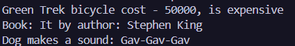

# Самостійна робота №1
### __Тема:__ Базовий синтаксис C# і оголошення класів.

# __Хід роботи:__
Було створено три класи: Bicycle, Book та Animal. У класі Bicycle реалізовано властивості та перевірку ціни велосипеда, у класі Book — збереження назви книги та автора, а в класі Animal — назви тварини та її звуку. Для кожного класу створено конструктор і метод для виведення інформації в консоль. У методі Main() створено об’єкти всіх трьох класів та продемонстровано роботу їхніх методів.

# __Результат:__ 
### 