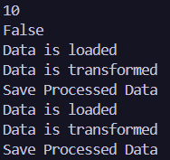

# Лабораторна робота №10
### __Тема:__ Абстрактні класи та інтерфейси. Контракти та реалізації.

### Варіант 6. IConverter та DataProcessor
* __Інтерфейс IConverter<TInput, TOutput>:__ TOutput Convert(TInput input).
* __Реалізації IConverter<string, int>:__ StringToIntConverter, StringToBoolConverter.
* __Абстрактний клас DataProcessor:__ abstract void LoadData(), abstract void TransformData(), void SaveProcessedData() (конкретний метод).
* __Похідні від DataProcessor:__ CsvProcessor, JsonProcessor.

# __Хід роботи:__
У ході лабораторної роботи було створено узагальнений інтерфейс IConverter<TInput, TOutput> з методом Convert(), а також реалізовано класи StringToIntConverter і StringToBoolConverter для перетворення рядків у відповідні типи даних. Далі було створено абстрактний клас DataProcessor, який містить абстрактні методи LoadData() і TransformData() та звичайний метод SaveProcessedData(). На його основі реалізовано класи CsvProcessor і JsonProcessor, у яких перевизначено абстрактні методи. У методі Main() було створено колекції інтерфейсного та абстрактного типів і виконано поліморфний виклик методів для різних реалізацій. У результаті програма успішно виконала перетворення даних та продемонструвала використання абстрактних класів, інтерфейсів і поліморфізму.
# __Результат:__ 
### 