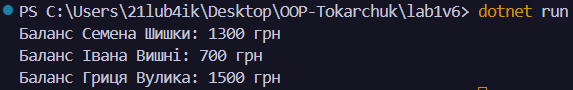

# Лабораторна робота №1
### __Тема:__ Створення першого проєкту. Класи, об’єкти, конструктори та деструктори.__
### Варіант: 6 - Клас BankAccount
* __Поля:__  owner, accountNumber.
* __Властивість:__ Balance.
* __Методи:__ Deposit() та Withdraw().

# __Хід роботи:__
Встановив середовище розробки VS Code з усіма необхідними розширеннями: C# Dev Kit; .NET Install Tool. 
Було створено консольний проєкт lab1v6 у директорії OOP-Tokarchuk. Відповідно до варіанту створив клас __BankAccount__. Клас містить:  __Приватні поля:__ власник рахунку та номер рахунку. __Публічні властивості для доступу до полів:__ баланс. __Конструктор для ініціалізації об’єкта.__ __Методи:__ поповнення рахунку, зняття коштів. __Метод, що виконує дію, пов’язану з класом.__ Створив клас __Program__. У методі __Main()__ було створено 3 об’єкти класу __BankAccount.__ Для об’єктів були викликані методи __Deposit()__ та __Withdraw()__ та __Console.WriteLine__ для виведення результатів програми. Створив __.gitignore__ у кореневій директорії __OOP-Tokarchuk__.

# __Результат:__ 
### 