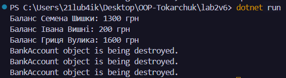

# Лабораторна робота №2
### __Тема:__ Клас із кількома конструкторами. Життєвий цикл об’єкта.
### Варіант: 6 - Клас BankAccount
* __Поля:__ _owner (string), _accountNumber (string), _balance (decimal).
* __Властивості:__ Owner, AccountNumber, Balance (тільки для читання, змінюється через методи).
* __Конструктори:__ параметризований (owner, accountNumber, initialBalance), конструктор, що викликає перший, але з initialBalance = 0.
* __Методи:__ Deposit(decimal amount), Withdraw(decimal amount) (з валідацією: сума > 0, достатньо коштів).

# __Хід роботи:__
### Було встановлене середовище розробки VS Code з усіма необхідними розширеннями: C# Dev Kit; .NET Install Tool. 
### Було створено консольний проєкт lab2v6 у директорії OOP-Tokarchuk. Відповідно до варіанту створив клас __BankAccount__. Клас містить:  __Приватні поля:__ власник рахунку  номер рахунку та баланс. __Публічні властивості для доступу до полів:__ Owner, AccountNumber та Balance. Для власника і номера рахунку передбачена перевірка на порожнє значення, а баланс доступний тільки для читання. __Перевантажені конструктори:__ один конструктор приймає власника, номер рахунку та початковий баланс, а другий - власника та номер рахунку і викликає перший конструктор через: this(), встановлюючи початковий баланс 0. __Методи:__ поповнення рахунку - Deposit(), зняття коштів - Withdraw().Методи перевіряють правильність суми та наявність достатньої кількості коштів. __Метод, що виконує дію, пов’язану з класом.__ Створив клас __Program__. У методі __Main()__ було створено 3 об’єкти класу __BankAccount.__ Для об’єктів були викликані методи __Deposit()__ та __Withdraw()__ та __Console.WriteLine__ для виведення результатів програми. Для демонстрації роботи фіналізатора було використано __GC.Collect()__ та __GC.WaitForPendingFinalizers()__.

# __Результат:__ 
### 