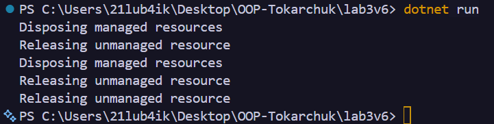

# Лабораторна робота №3
### __Тема:__ Життєвий цикл об’єкта та керування ресурсами.

### Варіант: 6. Клас AudioPlayer
* __Імітує__ аудіоплеєр.
* __Поля:__ _trackName (string), _isPlaying (bool).
* __Метод:__ Play(), Stop().
* __Dispose__: “звільняє аудіо ресурс”.

# __Хід роботи:__
Було встановлене середовище розробки VS Code з усіма необхідними розширеннями: C# Dev Kit; .NET Install Tool. 
Було створено консольний проєкт lab3v6 у директорії OOP-Tokarchuk. Відповідно до варіанту створив клас __AudioPlayer__. Клас реалізує інтерфейс __IDisposable__ та містить: __Приватні поля__: назву треку, стан відтворення та змінну для імітації виділеного ресурсу. __Публічні властивості:__ TrackName та IsPlaying. __Конструктор:__ приймає назву треку та виділяє ресурс. __Методи:__ Play() для початку відтворення та Stop() для його зупинки. Для звільнення ресурсів реалізовано метод __Dispose()__, метод Dispose(bool disposing) та фіналізатор. У методі Dispose() виконується звільнення ресурсу та викликається __GC.SuppressFinalize()__. У класі Program у методі __Main()__ було продемонстровано три способи очищення ресурсів: за допомогою __using__, явного виклику Dispose() та за допомогою фіналізатора. Для перевірки роботи фіналізатора було використано GC.Collect() та GC.WaitForPendingFinalizers().

# __Результат:__ 
### 