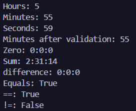

# Лабораторна робота №4
### __Тема:__ Властивості та статичні члени. Індексатори й перевантаження операторів.

### Варіант: 6. Клас LessonDuration (Проміжок часу)
* __Поля:__ _hours, _minutes, _seconds (int).
* __Властивості:__ Hours, Minutes (з валідацією: 0-59), Seconds (з валідацією: 0-59).
* __Статичний член:__ Zero (властивість, що повертає LessonDuration(0,0,0)).
* __Перевантажені оператори:__ + (додавання двох проміжків), - (віднімання).
* __Перевизначити__ ToString(), Equals(), GetHashCode(), ==, !=.

# __Хід роботи:__
У ході виконання лабораторної роботи я закріпив знання про властивості та статичні члени класу в C#. Було реалізовано клас __LessonDuration__ з приватними полями та властивостями __Hours__, __Minutes__ і __Seconds__ з перевіркою допустимих значень. Також було створено статичну властивість __Zero__, перевантажено оператори __+__, __-__, __==__ та __!=__, а також перевизначено методи __ToString()__, __Equals()__ і __GetHashCode()__. У методі __Main()__ було створено три об’єкти класу та продемонстровано роботу властивостей, валідації, статичного члена, операторів і методів порівняння. У результаті я отримав практичні навички створення більш функціональних класів та використання перевантаження операторів у C#.

# __Результат:__ 
### 