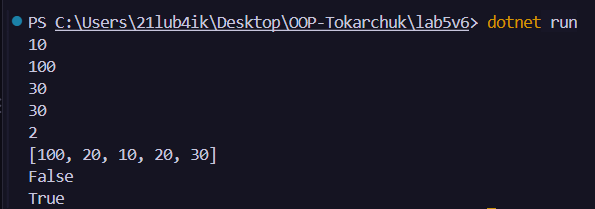

# Лабораторна робота №5
### __Тема:__ Індексатори та перевантаження операторів.

### Варіант: 6. Клас IntStack (Стек, спрощений)
* __Поле:__ List (int) _items.
* __Індексатор:__ this[int index] (доступ “знизу” стеку).
* __Оператори:__ + (об’єднання стеків), ==, !=.
* __Додатково:__ Push(int item), Pop(), Peek(), Count.

# __Хід роботи:__
У ході виконання лабораторної роботи було створено клас __IntStack__ відповідно до варіанту 6. У класі використано __поле__ List int _items для зберігання елементів стеку та __індексатор__ this[int index] для доступу до елементів за індексом. Для роботи зі стеком реалізовано __методи__ Push() для додавання елемента, Pop() для видалення останнього елемента, Peek() для отримання останнього елемента без видалення та властивість Count для визначення кількості елементів. Також було перевантажено оператори +, == та !=, реалізовано методи Equals(), GetHashCode() і ToString(). У методі __Main()__ створено два об’єкти класу IntStack, продемонстровано роботу індексатора, методів стеку та перевантажених операторів. У результаті було отримано практичні навички роботи з індексаторами, перевантаженням операторів і методами класу в C#.

# __Результат:__ 
### 
