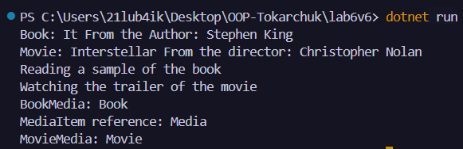

# Лабораторна робота №6
### __Тема:__ Наслідування. Ключові слова base, override, virtual. Приховування членів (new).

### Варіант 6. Ієрархія MediaItem → BookMedia → MovieMedia
* __MediaItem (базовий):__ Title, Duration. virtual void Play(). Конструктор.
* __BookMedia (похідний):__ Author. override void Play(). void ReadSample(). Конструктор, що викликає base.
* __MovieMedia (похідний):__ Director. override void Play(). void ShowTrailer(). Конструктор, що викликає base.
* __Демонстрація new:__ У BookMedia створити new string GetMediaType(), а в MediaItem -string GetMediaType().

# __Хід роботи:__
У базовому класі MediaItem створено ___приватні поля__ _title та _duration, __публічні властивості__ Title і Duration, __конструктор__, __віртуальний метод__ Play() та __метод__ GetMediaType(). __Класи__ BookMedia і MovieMedia успадковують MediaItem, мають власні властивості Author і Director, викликають __конструктор базового класу__ через base(...), перевизначають метод Play() за допомогою override та містять власні методи ReadSample() і ShowTrailer(). Для демонстрації приховування членів у BookMedia створено метод __GetMediaType()__ з модифікатором new. У методі __Main()__ створено об'єкти книги та фільму, продемонстровано поліморфізм через посилання типу MediaItem, а також показано різницю між override і new під час виклику GetMediaType(). Результати роботи програми виведено в консоль.
# __Результат:__ 
### 