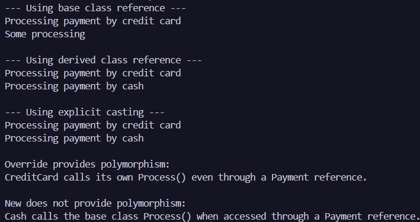

# Лабораторна робота №7
### __Тема:__ Приховування методів (new) vs перевизначення (override).

### Варіант 6. Ієрархія Payment → CreditCard (override) / Cash (new)
* __Базовий клас Payment:__ virtual void Process().
* __CreditCard:__ Override Process().
* __Cash:__ New Process().

# __Хід роботи:__
Базовий клас Payment містить віртуальний метод Process(), клас CreditCard перевизначає цей метод за допомогою override, а клас Cash приховує метод базового класу за допомогою new. У методі Main було створено об’єкти CreditCard і Cash, виконано upcasting до типу Payment, після чого метод Process() було викликано через посилання базового та похідних класів, а також із явним приведенням типів. За результатами виконання програми було продемонстровано, що override забезпечує поліморфізм: при зверненні до CreditCard через посилання типу Payment викликається перевизначений метод CreditCard, тоді як new поліморфізм не забезпечує: при зверненні до Cash через посилання типу Payment викликається метод базового класу Payment. Результати виконання були виведені в консоль із відповідними поясненнями.

# __Результат:__ 
### 