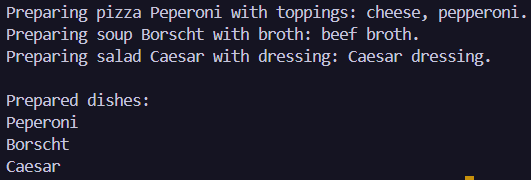

# Лабораторна робота №8
### __Тема:__ Поліморфізм: динамічне зв’язування та перевизначення методів.

### Варіант 6. Поліморфні страви: Dish → Pizza, Soup, Salad
* __Dish (базовий):__ Name. virtual void Prepare(). Конструктор.
* __Pizza:__ Toppings. override Prepare(). Конструктор.
* __Soup:__ BrothType. override Prepare(). Конструктор.
* __Salad:__ Dressing. override Prepare(). Конструктор.
* __Агрегація:__ Вивести список всіх приготованих страв.

# __Хід роботи:__
Було реалізовано ієрархію класів Dish, Pizza, Soup і Salad. У базовому класі Dish створено властивість Name та віртуальний метод Prepare(), який у похідних класах було перевизначено за допомогою override. У методі Main() створено колекцію типу List Dish, до якої додано об’єкти класів Pizza, Soup і Salad. За допомогою циклу foreach було виконано поліморфний виклик методу Prepare() для кожної страви. Також створено список preparedDishes, у якому зібрано назви всіх приготованих страв, що забезпечує виконання агрегації результатів. Після запуску програми результати поліморфних викликів та список приготованих страв було виведено в консоль.

# __Результат:__ 
### 