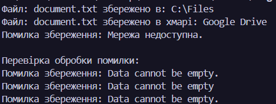

# Лабораторна робота №9
### __Тема:__ Поліморфні сервіси: Notification (Email/SMS/Push).

### Варіант 6. Збереження файлів: StorageService
* __Базовий клас:__ abstract class StorageService.
* __Похідні:__ LocalStorage, CloudStorage, FTPStorage.
* __Метод:__ abstract void Save(string filename, byte[] data).
* __Обробка помилок:__ Недостатньо місця, мережа недоступна.

# __Хід роботи:__
Під час виконання лабораторної роботи було створено систему збереження файлів на основі поліморфізму. Спочатку було створено абстрактний клас StorageService з абстрактним методом Save(), після чого реалізовано три похідні класи: LocalStorage, CloudStorage та FTPStorage. Для кожного класу було додано власні параметри збереження та перевірку вхідних даних. Далі було створено клас StorageManager, який працює зі списком об'єктів базового типу StorageService та викликає метод Save() для кожного сховища. Для обробки помилок використано конструкцію try-catch. У класі FTPStorage було змодельовано помилку недоступної мережі, а під час другого запуску навмисно передано null замість даних файлу для перевірки обробки помилок. У результаті програма продемонструвала роботу трьох типів сховищ, використання поліморфізму та коректну обробку помилкових ситуацій без аварійного завершення програми.
# __Результат:__ 
### 